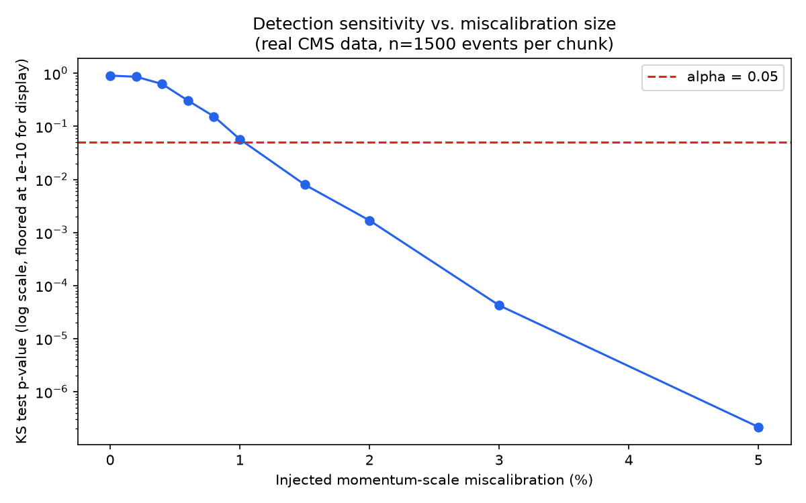
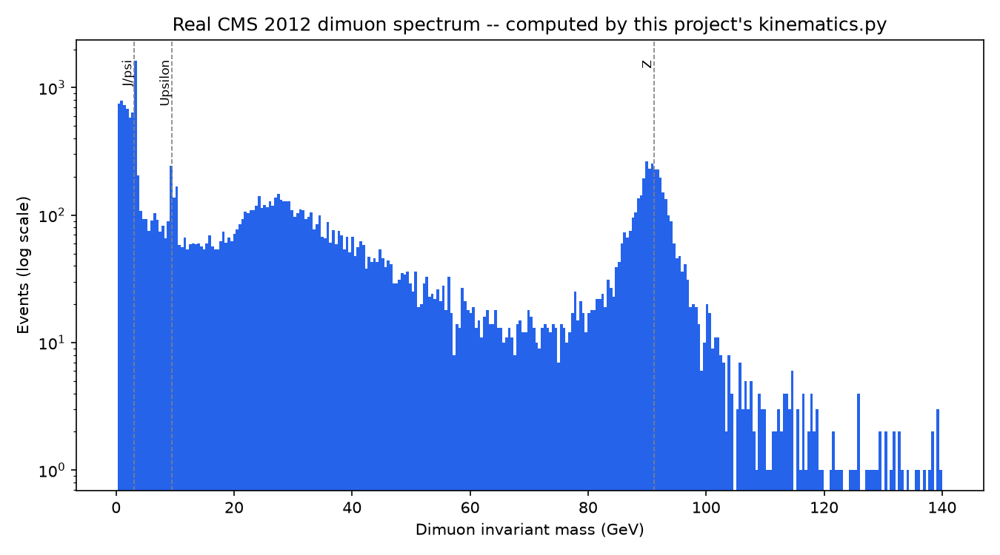

# Autonomous Data Quality Monitoring Agent — Dimuon Events

An agent (Claude API) that plays the role of a particle-detector Data
Quality Monitoring (DQM) shift worker: given successive chunks of dimuon
event data, it decides which statistical checks are worth running,
distinguishes real problems from statistical noise, and writes a
plain-language shift report — the same judgment a real ATLAS/CMS shift
crew makes, automated.

Validated end-to-end against **real CMS 2012 collision data**
(`Run2012BC_DoubleMuParked`), not just synthetic data. See
[`LAB_MANUAL.md`](./LAB_MANUAL.md) for full background, theory, and
procedure — this file is the quick-start / results summary.

## Headline result

Using real dimuon events from the CMS Open Data Portal:

- **0 / 12 false alarms** on unperturbed real data (specificity baseline)
- **Detects a muon momentum-scale miscalibration down to ~1.0–1.5%** at a
  chunk size of 1500 events, with clean separation from the false-alarm
  baseline (sensitivity, quantified via a full detection curve, not a
  single pass/fail case)




## Structure

```
dqm_agent/
├── dimuon/
│   ├── kinematics.py               relativistic invariant-mass math
│   ├── generate.py                 physically-exact synthetic dimuon events
│   ├── real_data_loader.py         loads real CMS Open Data (NanoAOD)
│   ├── real_data_false_positive_test.py   specificity check on real data
│   ├── real_data_sensitivity_test.py      single-case detection on real data
│   └── real_data_sensitivity_curve.py     full detection-threshold curve
├── monitors/
│   ├── distribution_shift.py       KS test, chi-square, Benjamini-Hochberg
│   └── drift_tracker.py            rolling-window trend vs. fluctuation
├── tests/
│   └── test_dimuon_pipeline.py     fast, free, deterministic (no API calls)
├── LAB_MANUAL.md                   background, theory, full procedure
└── README.md                       this file
```

`agent/` (the Claude tool-use loop connecting the above into an actual
autonomous agent) is scaffolded but not yet wired to real dimuon chunks —
see "Status" below.

## Quick start

```bash
pip install -r requirements.txt   # numpy, scipy, matplotlib, uproot, awkward
```

**Run the free/fast test suite** (synthetic data, no API calls, no network):
```bash
PYTHONPATH=. pytest tests/test_dimuon_pipeline.py -v
```

**Validate against real data** (requires downloading ~2GB from CERN Open Data):
```bash
pip install cernopendata-client
cernopendata-client get-file-locations --recid 12341 --protocol http
curl <the-url-it-prints> -o Run2012BC_DoubleMuParked_Muons.root

PYTHONPATH=. python3 dimuon/real_data_loader.py Run2012BC_DoubleMuParked_Muons.root
PYTHONPATH=. python3 dimuon/real_data_false_positive_test.py Run2012BC_DoubleMuParked_Muons.root
PYTHONPATH=. python3 dimuon/real_data_sensitivity_curve.py Run2012BC_DoubleMuParked_Muons.root
```

## Why dimuon events

Rather than an invented sensor scenario, this project uses real dimuon
invariant mass — the same quantity the official CMS Open Data outreach
example computes, and the same quantity real experiments use to calibrate
muon momentum scale off the known Z boson mass (91.19 GeV). The synthetic
"miscalibration" tested throughout this project is a real detector effect,
not an arbitrary injected anomaly — see `LAB_MANUAL.md` Section 2.1 and 2.5.

## Status

- ✅ Kinematics — validated against hand-computed cases and real CMS data
- ✅ Statistics layer (KS test, chi-square, BH correction) — validated on
  synthetic and real data, specificity + sensitivity both confirmed
- ✅ Drift tracking — validated on synthetic data (see LAB_MANUAL.md 5.1)
- ⬜ Full agent loop (Claude tool-use) wired to real dimuon chunks — the
  loop/tools scaffolding exists but hasn't yet been re-connected to the
  dimuon pipeline after the project moved from synthetic sensor channels
  to real physics data
- ⬜ Real-data drift tracking (only tested on synthetic data so far)


See `LAB_MANUAL.md` Section 5 for full detail, but briefly:

- Shape-based tests (KS, chi-square) cannot detect pure occupancy/count
  loss — a channel that goes mostly dead but keeps the same distribution
  shape among survivors passes both tests. Occupancy needs its own check.
- The choice of *what quantity to monitor* matters as much as the
  statistical test itself — tracking a whole-spectrum mean was too noisy to
  see a real drift; narrowing to the physically-relevant region (the Z peak)
  fixed it. This mirrors real calibration practice, not just an engineering
  workaround.
